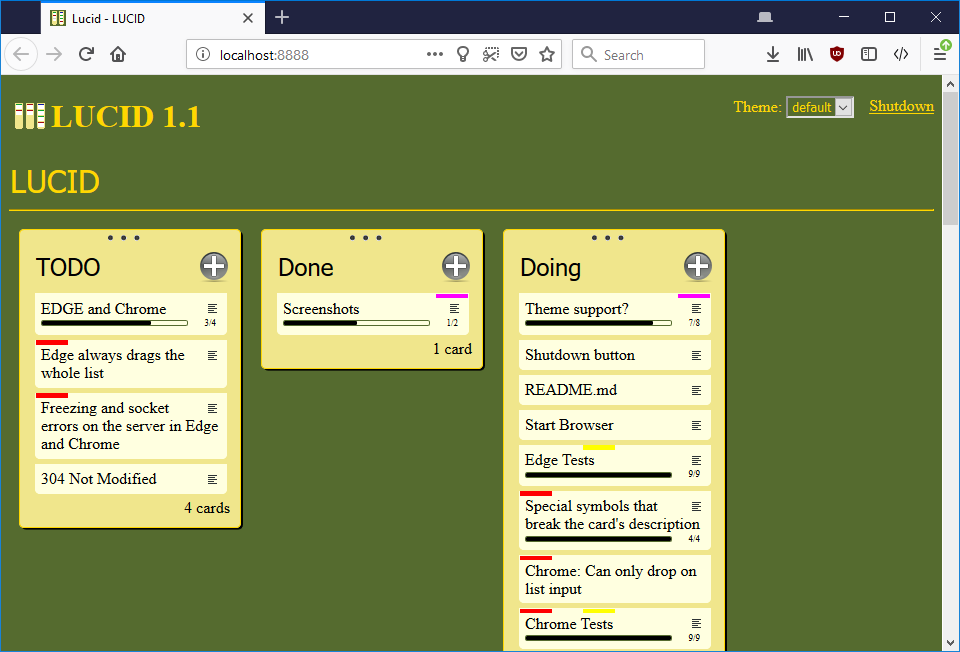

LUCID
=====

BottlePy web server hosting a web interface to manage your Kanban-style lists and cards.

Inspired by Trello and a dead WiFi card

Click  to add a new card

Click on a card to zoom on it and see more details

You can also drag and drop cards between lists, create more lists and rename them.

Instructions
------------

###Binaries
1. Install somewhere. ex: %appdata%\LUCID
1. Copy the shortcut inside to your project's source folder
1. Double-click the shortcut

###Sources
1. Install somewhere.
1. cd into your project's folder
1. python \path\to\lucid

Would you like to know more?
----------------------------

LUCID uses a JSON file for data storage. No database required. It creates the file LUCID.json in your project's folder. I suggest that you add it to your source control software.

If you ever want to work on 2 projects at the same time you'll have to use the -p option to specify a different port for the second project. eg: Shortcut properties, target field: \path\to\LUCID.exe -p 8081

The views are cached. If you want to mess around with the HTML, JS or CSS, disable the cache by using the -d flag when starting LUCID. eg: Shortcut properties, target field: \path\to\LUCID.exe -d

Now go kill some bugs, you wanna live forever!?